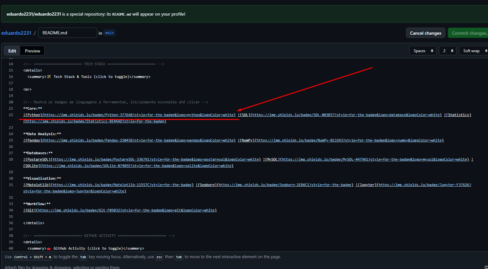
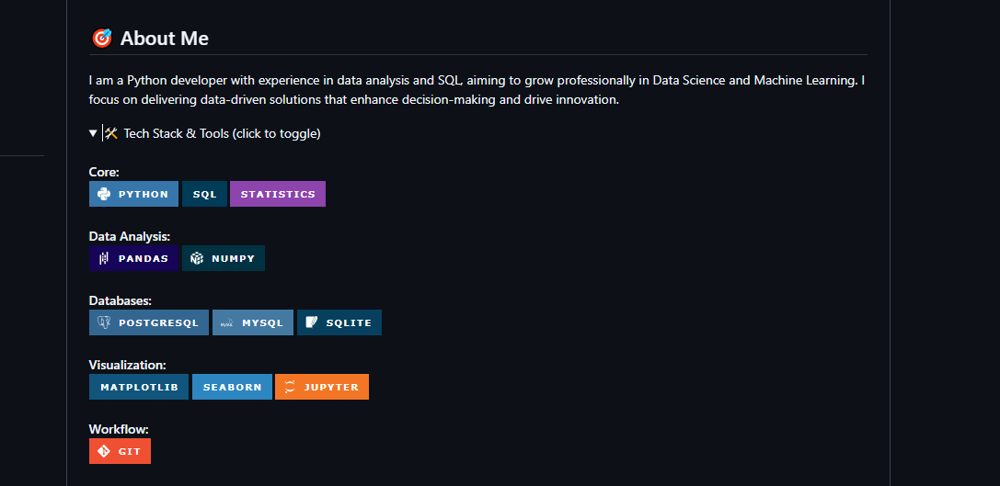

# StackAI

StackAI is an intelligent badge generator for developers that transforms technology names into professional GitHub-style badges using AI. Perfect for enhancing README files, portfolios, and project documentation with automatically generated, visually appealing badges.

## Features

- **AI-Powered Generation**: Utilizes Google's Gemini AI to create accurate and professional badges
- **GitHub-Style Badges**: Generates Shields.io compatible Markdown badges
- **Multiple Technologies**: Support for generating badges for multiple technologies at once
- **Streamlit Interface**: User-friendly web interface for easy badge creation
- **Instant Preview**: See generated badges immediately in the app

## Installation
👉 [----------- Open -----------](https://stackai-uwoeuvm7sucpeztswuj2pm.streamlit.app/)
1. Clone the repository:
   ```bash
   git clone https://github.com/eduardo2231/stackai.git
   cd stackai
   ```

2. Install dependencies:
   ```bash
   pip install -r requirements.txt
   ```

3. Set up your Groq API key (see API Key Setup below)

## API Key Setup

1. Get your API key from Groq
2. Create a file `app/.streamlit/secrets.toml` (create the .streamlit directory if it doesn't exist)
3. Add your API key:
   ```
   GROQ_API_KEY = "your_api_key_here"
   ```

## Usage

Run the Streamlit app:
```bash
streamlit run main.py
```

1. Open the app in your browser
2. Enter technology names (e.g., "Python, Docker, React")
3. Click "Gerar Badges" to generate badges
4. Copy the generated Markdown code to your README.md

## Screenshots




## Project Structure

```
stackai/
├── main.py                 # Main entry point
├── requirements.txt        # Python dependencies
├── app/
│   ├── ui.py              # Streamlit user interface
│   ├── badge.py           # Badge generation logic
│   ├── example.png        # Example screenshot 1 
│   └── example2.png       # Example screenshot 2
└── README.md              # This file
```

## Dependencies

- streamlit>=1.40.0
- requests==2.32.3
- groq
- pillow>=11.0.0

### UI/UX Improvements
- **Loading states**: Better spinner messages and progress indicators.
- **Input validation**: Client-side validation for technology names.
- **Export options**: Allow downloading badges as images or saving to clipboard.
- **Responsive design**: Ensure the Streamlit app works well on mobile devices.

### Security and Best Practices
- **Environment variables**: Consider using environment variables instead of secrets.toml for API keys.
- **Rate limiting**: Add rate limiting to prevent API abuse.
- **Input sanitization**: Sanitize user inputs to prevent injection attacks.

### Documentation
- **API documentation**: Document the internal functions and classes.
- **User guide**: More detailed usage instructions.
- **Contributing guide**: Add guidelines for contributors.

## Contributing

Contributions are welcome! Please feel free to submit a Pull Request.

## License

This project is licensed under the MIT License - see the [LICENSE](LICENSE) file for details.
