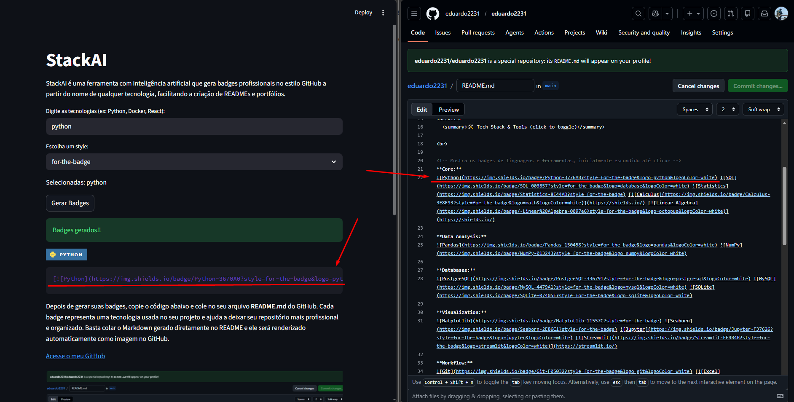

# GitHubMaker 
gitHubGenerate is an intelligent badge generator for developers that transforms technology names into professional GitHub-style badges using AI. Perfect for enhancing README files, portfolios, and project documentation with automatically generated, visually appealing badges.

## Features

- **AI-Powered Generation**: Leverages Groq AI to create accurate and professional badges
- **GitHub-Style Badges**: Generates Shields.io compatible Markdown badges
- **Multiple Technologies**: Supports generating badges for multiple technologies simultaneously
- **Streamlit Interface**: User-friendly web interface for easy badge creation
- **Instant Preview**: View generated badges immediately within the app

## Tech Stack

- **Python**: Core programming language
- **Streamlit**: Web framework for the user interface
- **Groq**: AI service for badge generation
- **Requests**: HTTP library for API interactions
- **Pillow**: Image processing library

## Installation

1. Clone the repository:
   ```bash
   git clone https://github.com/eduardo2231/stackai.git
   cd stackai
   ```

2. Install dependencies:
   ```bash
   pip install -r requirements.txt
   ```

3. Set up your Groq API key:
   - Obtain your API key from Groq
   - Create the directory `app/.streamlit/` if it doesn't exist
   - Create a file `app/.streamlit/secrets.toml` and add:
     ```
     GROQ_API_KEY = "your_api_key_here"
     ```

## Usage

Run the Streamlit app:
```bash
streamlit run main.py
```

1. Open the app in your browser
2. Enter technology names (e.g., "Python, Docker, React")
3. Click "Gerar Badges" to generate badges
4. Copy the generated Markdown code to your README.md

## Project Structure

```
stackai/
├── main.py                 # Main entry point for the Streamlit app
├── requirements.txt        # Python dependencies
├── LICENSE                 # Project license
├── app/
│   ├── sidebar.py          # Sidebar component for the UI
│   ├── ai/
│   │   ├── badge_ai.py     # AI logic for badge generation
│   │   └── github_ai.py    # GitHub-specific AI integrations
│   ├── assets/             # Static assets
│   └── templates/          # Template files
├── page/
│   ├── badges_maker.py     # Badge creation page logic
│   └── github_maker.py     # GitHub integration page logic
└── README.md               # This file
```

## API / Logic Explanation
The application uses Groq's AI API to interpret technology names and generate appropriate badge configurations. The `badge_ai.py` module handles the core AI interactions. The Streamlit interface in `main.py` orchestrates user input and displays results.

## Screenshots



## Future Improvements

- **Loading States**: Enhance spinner messages and progress indicators
- **Input Validation**: Implement client-side validation for technology names
- **Export Options**: Add functionality to download badges as images or save to clipboard
- **Responsive Design**: Optimize the Streamlit app for mobile devices
- **Security Enhancements**: Use environment variables for API keys and add rate limiting
- **Documentation**: Expand API documentation and user guides

## Contributing

Contributions are welcome! Please feel free to submit a Pull Request.

## License

This project is licensed under the MIT License - see the [LICENSE](LICENSE) file for details.
